# :mount_fuji: Reto Técnico Double V Partners.

<br/>
<br/>

## :bookmark_tabs: Tabla de contenido.

<br/>
<br/>

1. [Autor.](#black_nib-autor)

<br/>
<br/>

2. [Detalle de la solución.](#triangular_ruler-detalle-de-la-solución)

<br/>
<br/>

3. [Desplegar.](#airplane-desplegar)

<br/>
<br/>

## :black_nib: Autor.

<br/>
<br/>

**John Fredy Velasco Bareño** [jovel882@gmail.com](mailto:jovel882@gmail.com)

## :triangular_ruler: Detalle de la solución.

<br/>
<br/>

- Está desarrollado con:

    <br/>
    <br/>

    - PHP 8.1

        <br/>
        <br/>

    - Laravel 10.13

        <br/>
        <br/>

    - Vue.js 3

        <br/>
        <br/>

    - Bootstrap 5

        <br/>
        <br/>

    - Especificación [JSON:API](https://jsonapi.org/)

        <br/>
        <br/>

    - [Swagger UI](https://swagger.io/tools/swagger-ui/) y [OpenAPI 3](https://swagger.io/specification/)

        <br/>
        <br/>

    Se desarrolló basado en los requerimientos descritos en este [Documento](https://drive.google.com/file/d/1NmVi4IlpkQE3J4iJO-VL7k_7ybpuyyJP/view) y se consiguió lo siguiente:

    <br/>
    <br/>

    + Solución FrontEnd:

        <br/>
        <br/>

        + Módulos de usuarios GitHub:

            <br/>
            <br/>

            > :bulb: Todos los mensajes de error se generan usando un [componente](resources/js/Components/ErrorAlert.vue) desarrollado en Vue para ser fácilmente usado y extendido en todo el sitio.

            <br/>
            <br/>

            + Búsqueda, visualización y gráfica de los 10 primeros usuarios de GitHub.

                <br/>

                Se ubico en la raíz de sitios y cuenta con un [componente](resources/js/Components/GitHubUsers.vue) hecho en Vue. Ej. [http://doublev.test/](http://doublev.test/)

                <br/>
                <br/>

                > :bulb: Existe una validación para no poder visualizar el detalle de un usuario con un score menor a 0,5.

                <br/>
                <br/>

                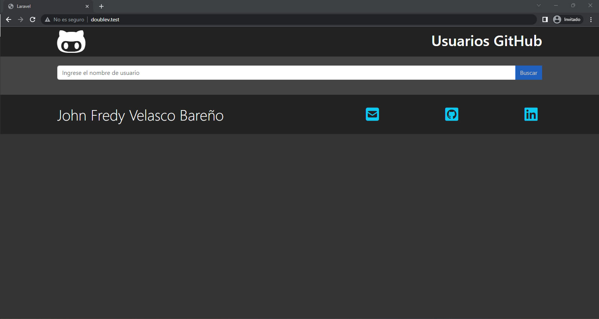

                <br/>
                <br/>

                > Interfaz inicial sin búsqueda.

                <br/>
                <br/>

                + Búsqueda exitosa.

                    <br/>
                    <br/>

                    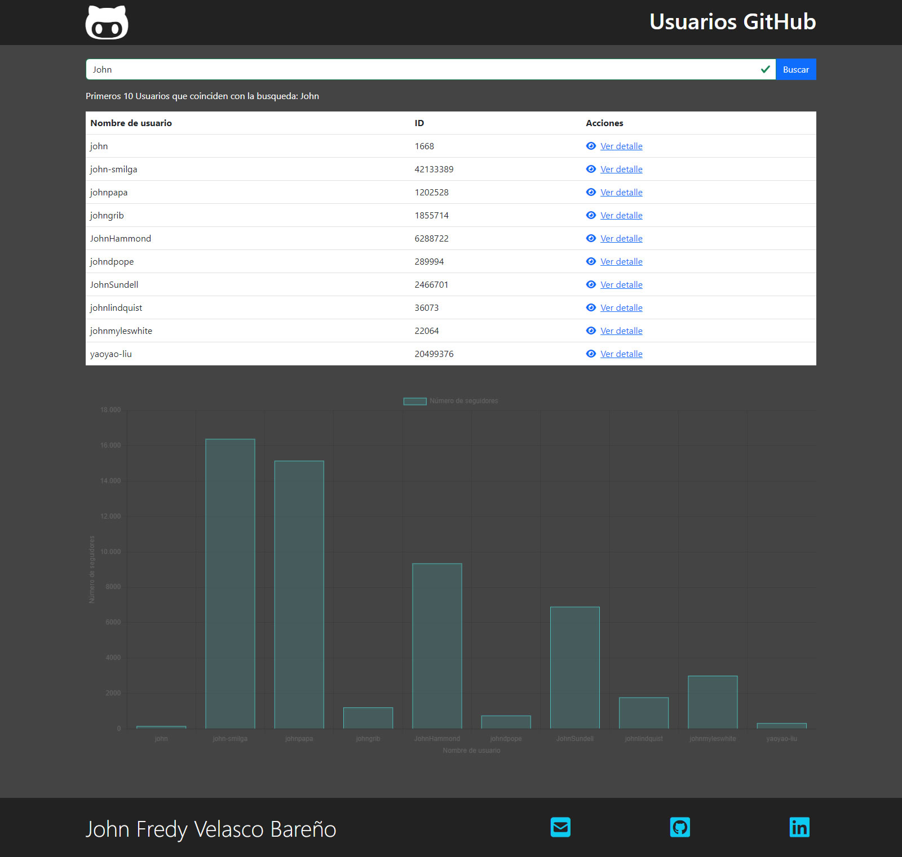

                    <br/>
                    <br/>

                    > Interfaz con la búsqueda y visualización exitosa.

                    <br/>
                    <br/>

                    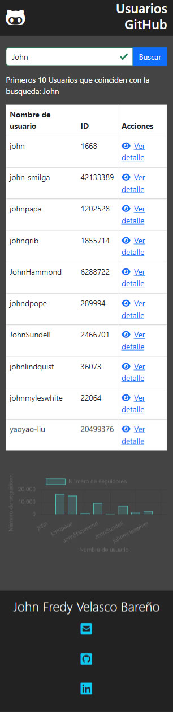

                    <br/>
                    <br/>

                    > Versión móvil.

                    <br/>
                    <br/>

                + Validación de usuario a buscar.

                    <br/>
                    <br/>

                    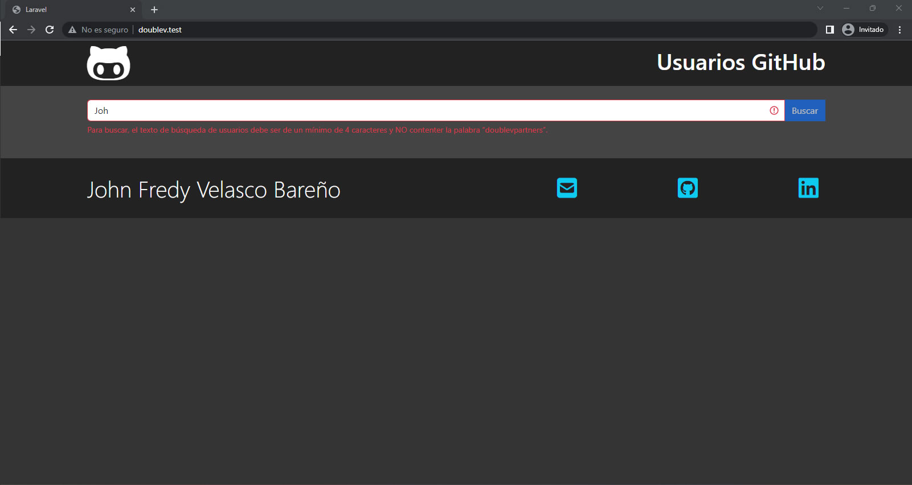

                    <br/>
                    <br/>

                    > Interfaz de error en el usuario ingresado.

                    <br/>
                    <br/>

                + Validación de usuario no encontrado.

                    <br/>
                    <br/>

                    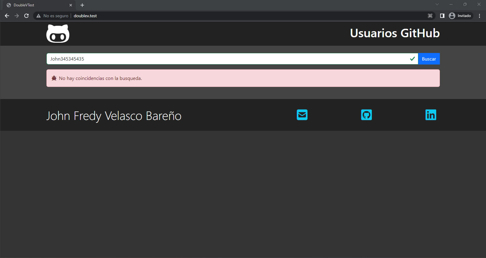

                    <br/>
                    <br/>

                    > Interfaz de error de usuario no encontrado.

                    <br/>
                    <br/>

                + Validación de falla en la generación de la gráfica.

                    <br/>
                    <br/>

                    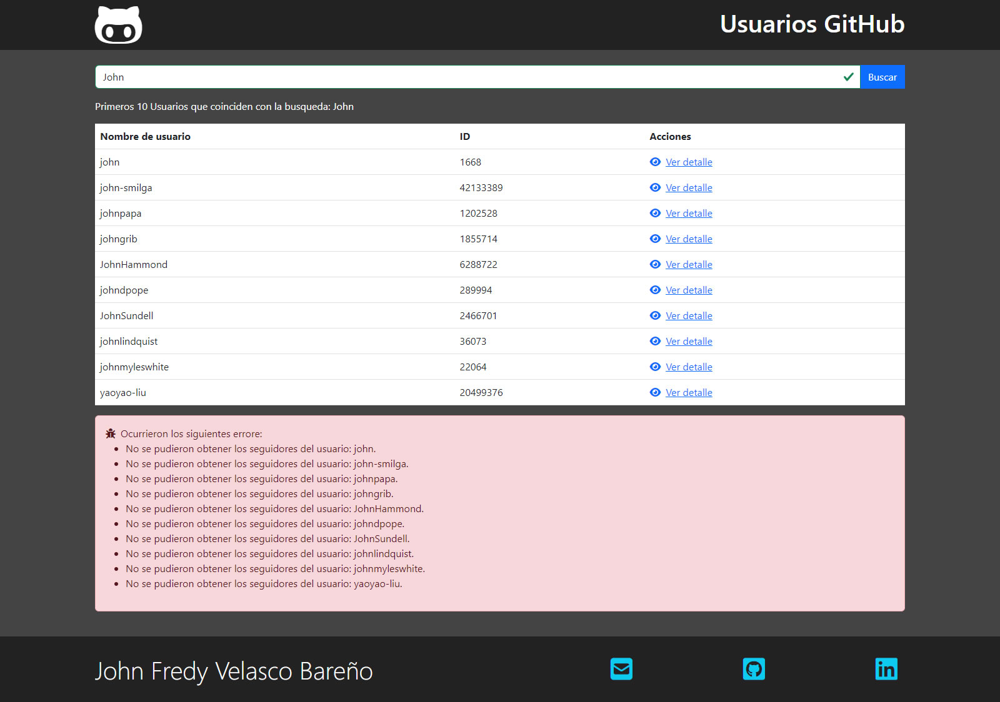

                    <br/>
                    <br/>

                    > Interfaz de error en generación de grafica.

                    <br/>
                    <br/>
            <br/>
            <br/>

            + Vista en detalle de usuarios de GitHub.

                <br/>

                Se desarrollo un [componente](resources/js/Components/GitHubUser.vue) en Vue para este módulo y Se ubico en la ruta `{urlBase}/details/{login}` donde `{login}` es el login de usuario a buscar. Ej. [http://doublev.test/details/jovel882](http://doublev.test/details/jovel882).

                <br/>
                <br/>

                + Búsqueda exitosa.

                    <br/>
                    <br/>

                    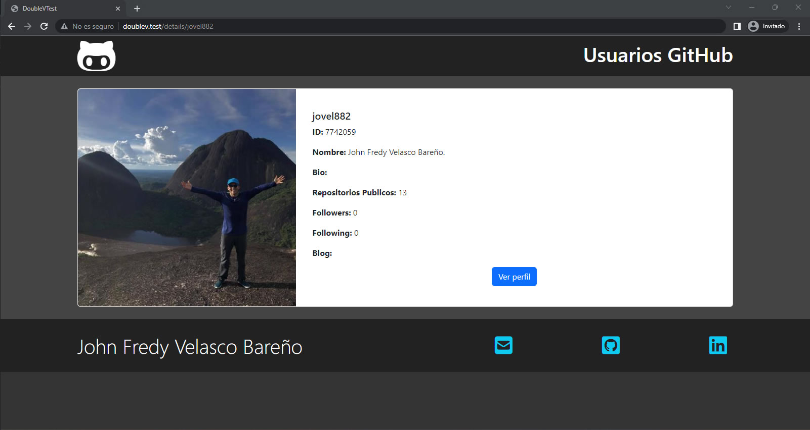

                    <br/>
                    <br/>

                    > Interfaz con la búsqueda y visualización exitosa.

                    <br/>
                    <br/>

                    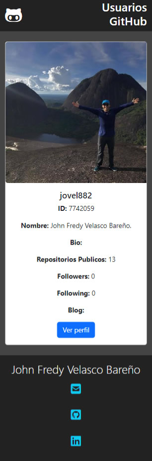

                    <br/>
                    <br/>

                    > Versión móvil.

                    <br/>
                    <br/>

                + Validación de usuario no encontrado.

                    <br/>
                    <br/>

                    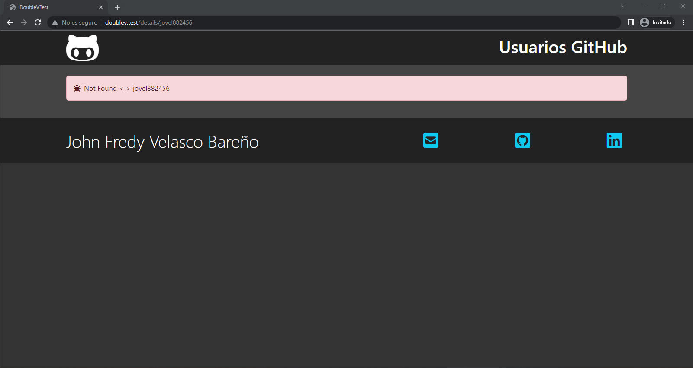

                    <br/>
                    <br/>

                    > Interfaz de error de usuario no encontrado.

                    <br/>
                    <br/>                   

                + Validación de falla en búsqueda.

                    <br/>
                    <br/>

                    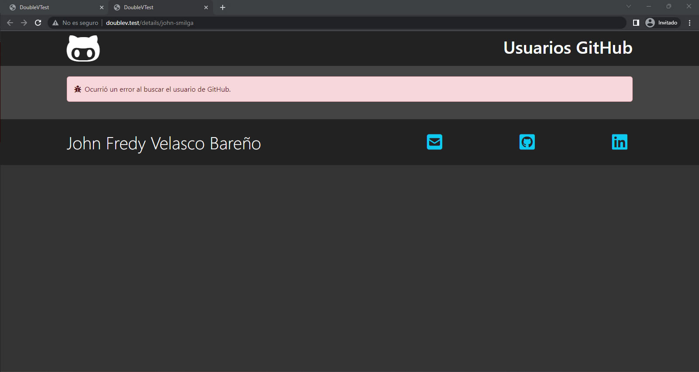

                    <br/>
                    <br/>

                    > Interfaz de error en la búsqueda.

                    <br/>
                    <br/>

    + Solución BackEnd:

        <br/>

        Se genero un API con especificación [JSON:API](https://jsonapi.org/) para realizar las operaciones básicas.

        <br/>
        <br/>

        + Autenticación y autorización.
        
            <br/>
            
            Cuenta con el estándar de Autorización OAuth 2.0 con un `grant_type` de tipo `client_credentials` con el paquete `Passport`.

            <br/>
            <br/>

            + Cliente para pruebas.

                <br/>

                Se cargo a través de un seeder un cliente para ser usado para pruebas, los datos son los siguientes:

                <br/>
                <br/>

                + `client_id`: 1

                <br/>
                <br/>

                + `client_secret`: mFRn19FSwRoObbZleJ8k9009Ct5E4ipY850n8Cb4

        <br/>
        <br/>

        + Modelo Ticket.

        <br/>

        Se creo el modelo ticket con su migración, seeder y model Factory para generar 100 registros aleatorios para pruebas.

        <br/>
        <br/>

        + Documentación y pruebas de la API.

            <br/>

            Se creo una documentación basada en [OpenAPI](https://swagger.io/specification/) para [SwaggerUI](https://swagger.io/tools/swagger-ui/) y está en la ruta `{urlBase}/api/documentation`. Ej. [http://doublev.test/api/documentation](http://doublev.test/api/documentation).

            <br/>
            <br/>

            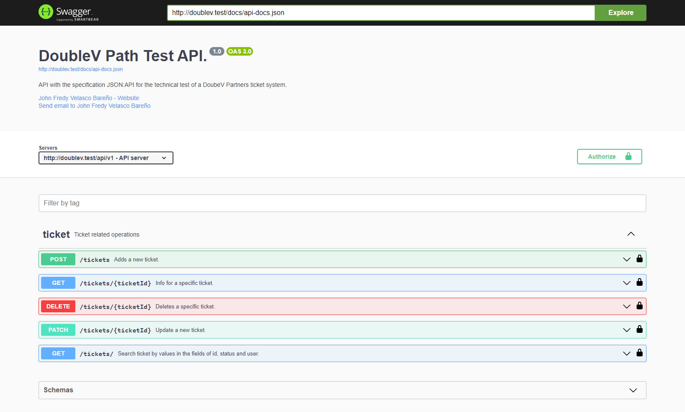

            <br/>
            <br/>

            > Interfaz base de documentación del Swagger UI.

            + Autorización.

                <br/>

                Para autorizar el Swagger UI y poder probar puedes usar el cliente para pruebas que se deja en esta misma documentación o en la misma interfaz de autorización de Swagger UI.

                <br/>
                <br/>

                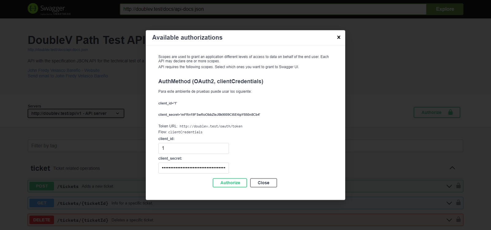

                <br/>
                <br/>

                > Interfaz de autorización del Swagger UI.              

        <br/>
        <br/>

## :airplane: Desplegar.

<br/>
<br/>

El proyecto cuenta con una opción de despliegue contenerizada con Docker, para usarla siga los siguientes pasos.

<br/>
<br/>

+ Prerrequisitos

    <br/>
    <br/>

    + **Docker >= 20.\***

    <br/>
    <br/>

    + **Docker Compose >=2.\***

    <br/>
    <br/>

    + **Git >=2.\***

    <br/>
    <br/>

+ Pasos

    <br/>
    <br/>

    > :bulb: Si está sobre algún sistema basado en Linux y ejecuta la siguiente línea, se iniciará un ambiente totalmente funcional sobre el DNS [doublev.test](http://doublev.test/).

    <br/>
    <br/>

    ```sh
    git clone https://github.com/jovel882/doubleV.git && cd doubleV && cp Docker/.env.example Docker/.env && docker compose -f Docker/docker-compose.yml up -d && docker logs -f doublev
    ```

    <br/>
    <br/>

    <br/>
    <br/>

    + Clone el repositorio

        <br/>
        <br/>

        ```sh
        git clone https://github.com/jovel882/doubleV.git
        ```

        <br/>
        <br/>

    + Ingrese al folder del proyecto.

        <br/>
        <br/>

        ```sh
        cd doubleV
        ```

        <br/>
        <br/>
            
    + Cree los archivos de entorno basados en los de ejemplo.

        <br/>
        <br/>

        + Genere el ***.env*** dentro del folder de **Docker**, estas son las variables disponibles.

            <br/>
            <br/>

            ```sh
            cp Docker/.env.example Docker/.env
            ```

            <br/>
            <br/>
            
            + `COMPOSE_PROJECT_NAME` (\*Requerido): Define el nombre del proyecto que se genera con Docker Compose, en el ejemplo se deja **doublev**.

            <br/>
            <br/>
            
            + `MYSQL_DATABASE` (\*Requerido): Define el nombre de la base de datos que se creará.

            <br/>
            <br/>
            
            + `MYSQL_ROOT_PASSWORD` (\*Requerido): Define la contraseña del usuario root del motor de base de datos. **NOTA: No dejar vacío**.

            <br/>
            <br/>

    + Variables dentro del archivo **"docker-compose.yml"**.

        <br/>
        <br/>

        + Dentro del servicio de nombre **"doublev"** en la sección de **"environment"**

            <br/>
            <br/>

            + `VIRTUAL_HOST` (\*Requerido): Define el nombre del DNS sobre el que se levantará el ambiente, por defecto se utiliza **doublev.test**.
                
            <br/>
            <br/>

    + Ejecute el archivo docker-compose.yml para levantar el ambiente.
    
        <br/>
        <br/>

        ```sh
        docker compose -f Docker/docker-compose.yml up -d
        ```

        <br/>
        <br/>

    + Siga el estado del despliegue del contenedor principal con el siguiente comando.

        <br/>
        <br/>

        ```sh
        docker logs -f doublev
        ```

        <br/>
        <br/>

        > :pushpin: En este log, si todo está correcto, podrá ver la instalación de paquetes con Composer, instalación de paquetes con NPM, compilado de archivos con NPM, ejecución de migraciones, ejecución de seeders y finalmente el inicio de los servicios del servidor web con Supervisor, entre otros.

        <br/>
        <br/>

    + Agregue el registro del host para redirigir las peticiones al **DNS** que se definió en **VIRTUAL_HOST** del archivo **"docker-compose.yml"**. En este [enlace](https://www.siteground.es/kb/archivo-hosts/) hay una forma de hacerlo dependiendo de su sistema operativo.

        <br/>
        <br/>
        
        **Ejemplo:**    

        <br/>
        <br/>

        ```sh
        127.0.0.1 doublev.test
        ```

    <br/>
    <br/>

    + Acceda al resultado de la solución **http://{DNS}**, donde **DNS** debe ser reemplazado por el que se definió en **VIRTUAL_HOST** del archivo **"docker-compose.yml"**. Ej. [http://doublev.test](http://doublev.test)

    <br/>
    <br/>
